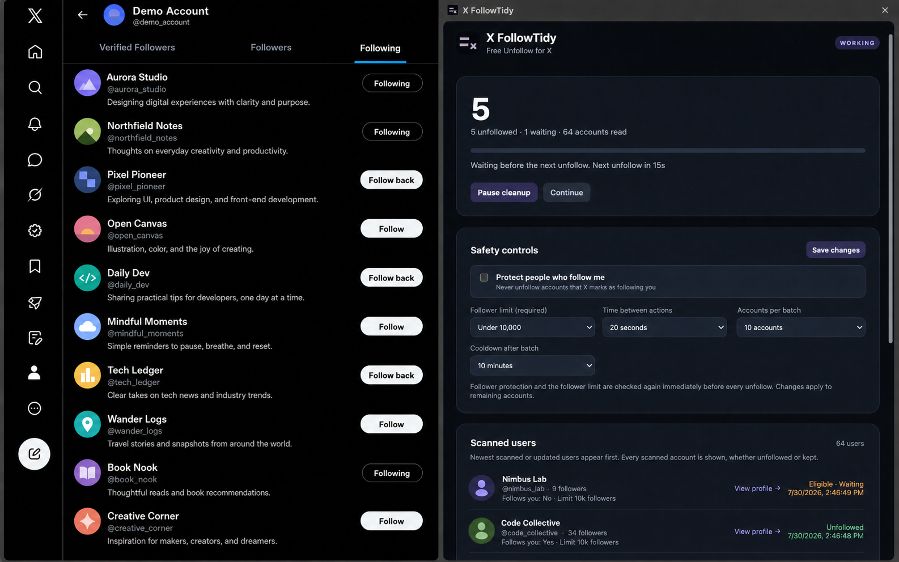

<p align="center">
  
</p>

<h1 align="center">X FollowTidy</h1>

<p align="center">
  A free, local-first Chrome extension for safely tidying your X Following list.
</p>



<p align="center"><sub>Promotional preview using fictional demo accounts and generated avatars.</sub></p>

> [!CAUTION]
> X FollowTidy automates unfollow actions in the browser. X may change its interface or apply account-specific action limits. Use conservative pacing, keep batches small, and stop if X displays a warning. This project is not affiliated with or endorsed by X Corp.

## What it does

X FollowTidy processes the Following list as a bounded stream: it checks one visible account, applies the configured safety rules, optionally unfollows that account, and only then moves to the next one. It does not need to pre-scan the entire list.

Key features:

- Starts from any browser tab by opening `https://x.com/following` automatically.
- Filters accounts using a required follower-count limit.
- Optionally protects accounts that X identifies as following you.
- Re-verifies safety conditions immediately before every unfollow.
- Supports a delay between actions, batch size, and batch cooldown.
- Pauses automatically when X rejects or rate-limits an unfollow.
- Shows progress and controls in a tab-specific Chrome side panel.
- Records every scanned account with its avatar, name, handle, follower count, follow-back status, and outcome.
- Provides a paginated history with direct profile links.
- Stores settings and run history locally in Chrome.
- Remains free, with an optional [GitHub Sponsors](https://github.com/sponsors/0xAllenChen) link.

## Safety model

An account is eligible only when all enabled checks pass:

1. The account is still visible in the current Following list.
2. Its handle matches the X hover card being inspected.
3. Its follower count is read from that account's exact `/followers` or `/verified_followers` link.
4. Its verified follower count is strictly below the configured limit.
5. If follow-back protection is enabled, X confirms that the account does not follow you.
6. The same immutable verification snapshot is checked again before the confirmation click.

Unknown or unverifiable values are protected and skipped.

## Install locally

Requirements:

- Google Chrome 116 or newer
- A signed-in X account

Installation:

1. Download or clone this repository.
2. Open `chrome://extensions`.
3. Enable **Developer mode**.
4. Click **Load unpacked**.
5. Select the repository folder containing `manifest.json`.
6. Pin **X FollowTidy** to the Chrome toolbar if desired.

After changing local files, return to `chrome://extensions`, click the extension's reload button, and refresh any open X Following page.

## Usage

1. Open X FollowTidy from the Chrome toolbar on any page.
2. Choose the follower limit and whether to protect people who follow you.
3. Set the required action delay, batch size, and cooldown.
4. Click **Start cleaning**.
5. X FollowTidy opens your Following page, waits for it to load, and starts automatically.
6. Use the side panel to review scanned accounts, change remaining-run settings, pause, or continue.

Keep the X Following tab open while a cleanup is running. If X stops loading new accounts before the exact Following total is reached, X FollowTidy pauses instead of falsely reporting completion.

## Privacy

X FollowTidy has no application server, analytics, or telemetry. Settings, scanned-account records, and cleanup history stay in Chrome local storage.

See [PRIVACY.md](PRIVACY.md) for the full privacy summary.

## Permissions

| Permission | Why it is needed |
| --- | --- |
| `storage`, `unlimitedStorage` | Save settings, progress, and local scan history. |
| `tabs` | Open and track the user-requested X Following tab. |
| `scripting` | Load the worker into the Following page when needed. |
| `sidePanel` | Display progress and controls beside X. |
| `https://x.com/*` | Inspect the Following list and perform requested actions. |

## Development

The extension uses plain HTML, CSS, and JavaScript with no runtime dependencies or build step.

```bash
npm test
npm run check
```

Chrome Web Store submission copy, permission justifications, and privacy-field notes are available in [STORE_LISTING.md](STORE_LISTING.md).

Project layout:

```text
.
├── manifest.json          Chrome MV3 manifest
├── background.js          Run coordination, storage, and side-panel lifecycle
├── content.js             Following-list scanner and safety-checked unfollow worker
├── filter-utils.js        Locale-aware follower-count parsing and cap validation
├── popup.*                Start flow and initial settings
├── dashboard.*            Side-panel progress, controls, and history
├── assets/                 Privacy-safe promotional screenshots
├── store-assets/           Chrome Web Store listing graphics
├── icons/                 Extension icons
├── tests/                 Node-based safety and parser checks
└── PRIVACY.md             Privacy summary
```

## Known limitations

- X can change its DOM structure without notice.
- List loading may stall if X throttles or stops rendering the virtualized timeline.
- Follow-back detection depends on relationship information exposed by X.
- Automated actions may be restricted by X even with conservative pacing.
- The current session is page-owned; closing or refreshing the worker tab ends that session.

## Support the project

X FollowTidy is free. If it saves you time, you can optionally support development through [GitHub Sponsors](https://github.com/sponsors/0xAllenChen).

## Project status

Current version: **1.0.0**

This repository is currently maintained as a private project while the extension is being tested and hardened.
